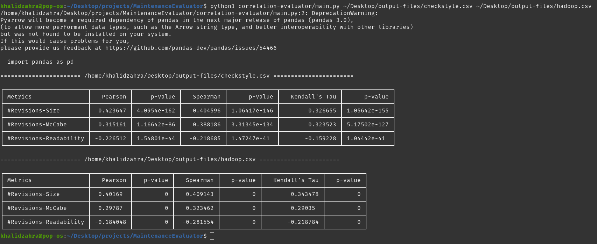

# Measurement Evaluator
This project aims to indicate the change-proneness of a method using code metrics,
and find out if there are statistically significant correlations between them. Specifically, CodeShovel was used to 
extract 73,733 methods from [Hadoop](https://github.com/apache/hadoop) and 
3,733 methods from [Checkstyle](https://github.com/checkstyle/checkstyle) into JSON files that contain their bodies and 
change histories.
<br>
<strong>Important: </strong> The CSV files containing all metrics for both projects are in the <u>metrics folder</u> in the root project directory.
## Output
For each method, the project calculates the size, McCabe complexity, readability, and #Revisions. These metrics are then
output into CSV files, one for each project, in the following format:
|  JSON # 	|   Size (SLOC) 	|   McCabe  	|   Readability 	|   #Revisions  	|
|---	|---	|---	|---	|---	|

After that, a python script is used to calculate the Pearson, Spearman, and Kendall's Tau correlation coefficients and
P-values.
## Run Instructions - Code Metrics Calculator
1. Move to the resources folder by running the following command while in the root folder of the project:
```bash
cd src/main/resources
```
2. Install the read-tse-1.0.0 JAR to your local maven repository by running the following command:
```bash
mvn install:install-file -Dfile=read-tse-1.0.0.jar -DgroupId=raykernel.apps -DartifactId=readability -Dversion=1.0 -Dpackaging=jar
```
3. Go back to the root directory of the project by running:
```bash
cd ../../..
```
4. Build the MaintenanceEvaluator JAR by running the following command:
```bash
mvn clean package assembly:single
```
5. Run the JAR file using the following command:
```bash
java -jar MaintenanceEvaluator-1.0-SNAPSHOT-jar-with-dependencies.jar <inputDirectory1> <inputDirectory2>... -o <outputDirectory>
```
Example: 
```bash
java -jar MaintenanceEvaluator-1.0-SNAPSHOT-jar-with-dependencies.jar /home/khalidzahra/Desktop/data/checkstyle/ /home/khalidzahra/Desktop/data/hadoop/ -o /home/khalidzahra/Desktop/output-files
```
The -o flag is optional. If no output is specified, the files will be created in the same directory as the JAR.
## Run Instructions - Correlation Evaluator
1. Install the required dependencies by running:
```bash
pip install -r correlation-evaluator/requirements.txt
```
2. Run the correlation evaluator using the following command:
```bash
python3 correlation-evaluator/main.py <csvPath1> <csvPath2>...
``` 
Example:
```bash
python3 correlation-evaluator/main.py ~/Desktop/testerman/checkstyle.csv ~/Desktop/testerman/hadoop.csv
```
Sample Output:
